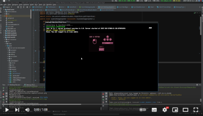

# D2D2 World Arena

D2D2 World Arena is a multiplayer video game with a map editor, serving as both a server and client solution.

## About the Project

D2D2 World Arena provides players with a multiplayer gaming experience along with a map editor. 

## Project Goal

The primary objective of D2D2 World Arena is to test and enhance the capabilities of the [D2D2 Core framework](https://github.com/Anc3vt/d2d2-core). By implementing various features and mechanics within a real-world gaming environment, the project aims to identify and address potential issues while improving the overall performance and versatility of the framework.

## Components

The project comprises the following key modules:

-   **d2d2-world-arena**: The core module containing essential classes and tools for creating multiplayer game environments.
-   **d2d2-world-arena-client**: The client-side module responsible for rendering game graphics, handling user input, and communicating with the server.
-   **d2d2-world-arena-server**: The server-side module managing game sessions, player interactions, and data synchronization between clients.
-   **d2d2-world-arena-networking**: Networking facilities enabling seamless interaction between players in multiplayer mode.
-   **d2d2-world-arena-editor**: An editor for crafting and refining game levels and scenes.

### Network Synchronization demo video (Click to watch)

